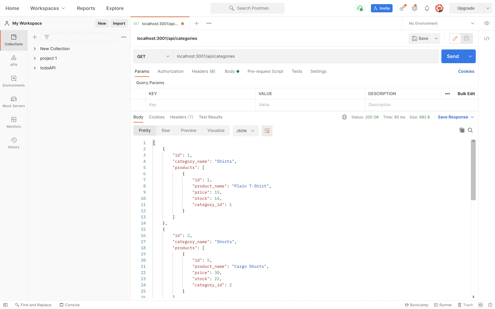

# Object-Relational Mapping (ORM): E-Commerce Back End

In this project I built out the back end for an e-commerce site by modifying starter code. Configured a working Express.js API to use Sequelize to interact with a MySQL database. This app has full CRUD capability as you can CREATE, READ, UPDATE, and DELETE from this database.


  * [Installation](#install)
  * [Usage](#usage)
  * For a video on using the app click [here.](https://drive.google.com/file/d/1OK0mcV8EBXbN9NJmn3xaCKlokZ0TQHeM/view?usp=sharing)


## User Story

- AS A manager at an internet retail company
- I WANT a back end for my e-commerce website that uses the latest technologies
- SO THAT my company can compete with other e-commerce companies


## Install

Clone project.
Run the following line of code in your terminal to install all the needed packages: 
```
npm i
```


## Usage

Once all the packages have been installed build your DataBase. You can use Mysql workbench to create your DB or run command line:
```
mysql -u root -p
```
and create your DB there. Once DB has been created run in your terminal:
```
npm run seed
```
to seed your DB. Once your DB is completed run in your terminal:
```
npm start
```
This will start your server. From there you can use Postman App to test out all your API calls.
* [Download Postman App here.](https://www.postman.com/downloads/)


## Built With

- JavaScript
- Sequelize
- Node.js
  - dotenv
  - express
  - mysql2
  - sequelize

## Screen shots


